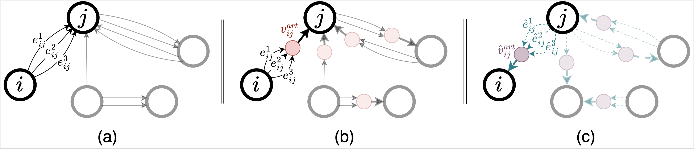

# Mega-GNN


## Abstract 
Graph Neural Networks (GNNs) have seen significant advances in recent years, yet their application to multigraphs, where parallel edges exist between the same pair of nodes, remains under-explored. Standard GNNs, designed for simple graphs, compute node representations by combining all connected edges at once, without distinguishing between edges from different neighbors. There are some GNN architectures proposed specifically for multigraph tasks, yet these architectures perform only node-level aggregation in their message-passing layers, which limits their expressive power. Furthermore, these approaches either lack permutation equivariance when a natural edge ordering is absent, or fail to preserve the topological structure of the multigraph. To address all these shortcomings, we propose MEGA-GNN, a unified framework for message passing on multigraphs that can effectively perform diverse graph learning tasks. Our approach introduces a two-stage aggregation process in the message passing layers: first, parallel edges are aggregated, followed by a node-level aggregation that operates on aggregated messages from distinct neighbors. We show that MEGA-GNN supports permutation equivariance and invariance properties. We also show that MEGA-GNN is universal when the edges are consistently ordered. Experiments on synthetic and real-world financial transaction datasets demonstrate that MEGA-GNN either significantly outperforms or is on par with the accuracy of state-of-the-art solutions.

<p align="center">
  
</p>
<p align="left">
  Figure 1: <strong>Illustration of Multi-Edge Aggregation using artificial nodes in a multigraph</strong> (a) A multigraph with parallel edges (b) Artificial nodes positioned between adjacent pairs of nodes to handle the aggregation of parallel edges. First, the information from the parallel edges are aggregated into some embedding vectors in the artificial nodes, and then the destination node performs a node-level aggregation on these embeddings. (c) Illustration of the reverse message passing mechanism. In directed multigraphs, reverse edges are created in the reverse direction of the original edges, and then additional artificial nodes are introduced to handle the aggregation of these reverse edges. Separate message computations are performed to handle the original and reversed edges. The result is a bi-directional multigraph message passing solution.
</p>

## Installation

### Update and Install Required Packages
```bash
apt-get update && \
        apt-get install -y libopenmpi-dev curl wget vim watch procps ncdu tree unzip && \
        apt-get clean && rm -rf /var/lib/apt/lists/*
```

### Download and install Miniforge

```bash
curl -fsSL https://github.com/conda-forge/miniforge/releases/latest/download/Miniforge3-Linux-x86_64.sh -o miniforge.sh && \
bash miniforge.sh -b -p /opt/conda && \
rm miniforge.sh
```

### Initialize Conda
```bash
. /opt/conda/etc/profile.d/conda.sh
. /opt/conda/etc/profile.d/mamba.sh
/opt/conda/bin/conda init bash
```


### Create a new Conda environment
```bash
mamba env create --quiet --file env.yml
```
    
### Activate the environment
```bash
conda activate megagnn
```

### Install GenAgg
```bash
cd genagg 
pip install -e 
```

## Data
The data needed for the experiments can be found on [Kaggle](https://www.kaggle.com/datasets/ealtman2019/ibm-transactions-for-anti-money-laundering-aml/data). To use this data with the provided training scripts, you first need to perform a pre-processing step for the downloaded transaction files (e.g. `HI-Small_Trans.csv`):
```
python format_kaggle_files.py /path/to/kaggle-files/HI-Small_Trans.csv
```
Make sure to change the filepaths in the `data_config.json` file. The `aml_data` path should be changed to wherever you stored the `formatted_transactions.csv` file generated by the pre-processing step.

The data for node classification experiments can be found on [ETH-Kaggle](https://www.kaggle.com/datasets/xblock/ethereum-phishing-transaction-network).
- Networkx graph structure needs to be pre-processsed. Graph should be saved in two seperate `.csv` files (nodes.csv and edges.csv). Edges are transactions, they will hold informations [fromm_address, to_address, value ,timestamp] and nodes are arrange such that each node has [address, first_transaction] where first_transaction is the first timestamp of a node recevied/make transaction.


## Licence
Apache License
Version 2.0, January 2004
